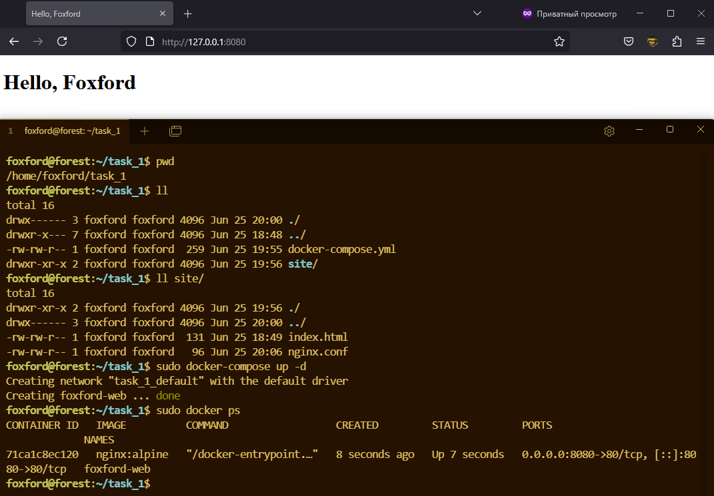
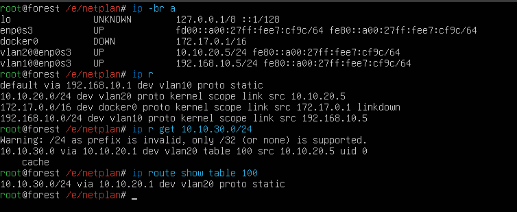
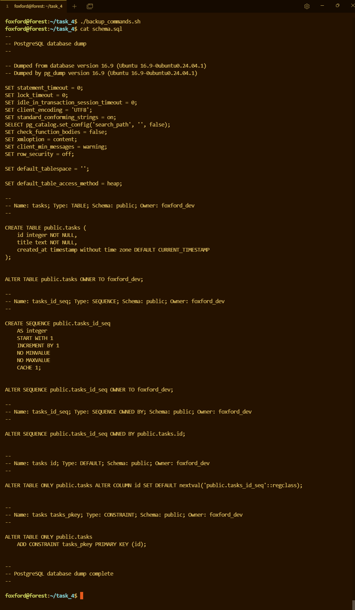
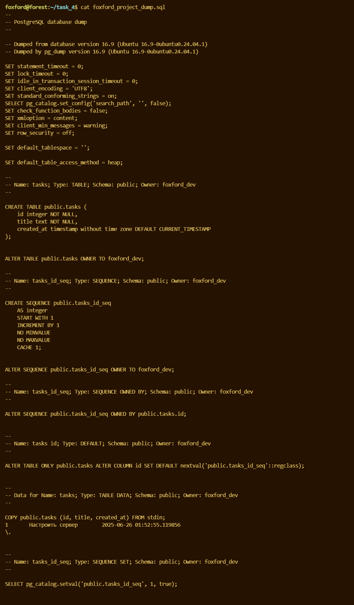

# ТЗ, системный администратор  
  
## Структура проекта ##

Этот проект содержит материалы и конфигурации для выполнения заданий по настройке Ubuntu 24.04 в VirtualBox с использованием NAT + проброса портов.  
Все файлы организованы в домашней директории /home/foxford/ и распределены по поддиректориям для каждого задания.  
```
Общая структура  GIT
orange-fox/  
├── task_1/                     # Задание 1: Настройка веб-сервера с Nginx через Docker  
├── task_2                      # Задание 2: Теория и Траблшутинг  
├── task_3                      # Задание 3: Настройка сети (L2/L3)  
├── task_4                      # Задание 4: PostgreSQL 
└── screen                      # Скриншоты к заданиям 
    ├── task_1                  # Скриншот к 1 работе  
    ├── task_2                  # Скриншот к 2 работе  
    ├── task_4_1                # Скриншот "schema.sql"
    └── task_4_2                # Скриншот "foxford_project_dump.sql"
```

## 🦊 Задание 1 🦊

 Для `./site` и всего что внутри сразу меняю права `chmod -R 755`  
Cобрал конфиги:  
`index.html`:  
```
<!doctype html>
<html>
  <head>
    <title>Hello, Foxford</title>
  </head>
  <body>
    <h1>Hello, Foxford</h1>
  </body>
</html>
```
`nginx.conf`  **# Самое примитивное исполнение**
```
server {
    listen 80;

    location / {
        root /site;
        index index.html;
    }
}
```
Задание по всей видимости с подвохом, так как требовалось смонтировать именно локальную директорию `./site` а не файлы по отдельности.  
К сожалению способов превратить `./site` в `default.conf` я не знаю поэтому итоговый `docker-compose.yml` выглядит так:  
```
services:
  web:
    image: nginx:alpine  
    container_name: foxford-web
    ports:
      - "8080:80"
    volumes:
      - ./site:/site 
      - ./site/nginx.conf:/etc/nginx/conf.d/default.conf
    restart: unless-stopped
```  
После, находясь в директории `/home/foxford/task_1` запускаю контейнер:  
  

## 🚨 Задние 2 🚨 
Общий план действий такой:
1. Оценить - это разовый пик или постоянная нагрузка, убедиться что проблема действительно существует
2. Определить модуль который вызывает проблему (в данном случае процесс).
3. Определить - это ожидаемая нагрузка (возможно, рост трафика) или ошибка.
4. Назначить лечение/профилактику.

Для оценки состояния системы я использую `htop` или само собой `htop`
Примерно понимая в каких целях используется сервер и запустив `htop` сразу буду следить за состоянием LA и процессом (PID) который грузит CPU.
Далее в случае с "CPU utilization = 100%" на мой взгляд возможны 3 ситуации. 

* CPU utilization = 100%  
  * Load Average > кол-ва ядер  
   * Проблема явно присутствует, процессы в очереди.

* CPU utilization = 100%  
  * Load Average ≤ кол-ва ядер  
  * Не очень хорошо, но и не ЧП,  беру во внимание и начинаю разбираться, главное отсутсвие очереди
  * Часто бывает, ситуация, когда  один поток или один процесс грузит одно ядро на 100%, но остальные ядра свободны.
Такое может быть, если  приложение не умеет распараллеливаться.

* CPU utilization = 10-20%
  * Load Average высокий
  * Это скорее IO - задержки тоже плохо. Процессы ждут не CPU, а например, доступ к диску или сети

Если проблема подтвердилась и мне известно, что это веб-сервер, необходимо обратиться к документации.
На моей практике `journalctl` в таких случаях и на таком этапе не помощник, в первую очередь стоит посмотреть чем занимается приложение и почему идет высокое потребление. Логи приложения - куда важнее, там могут содежраться: трассировки ошибок, сообщения разработчиков, подсказки о причине проблемы. Systemd не всегда захватывает ошибки уровня приложения (например, если приложение не крашится, а просто уходит в петлю).

Зачему странности, начну в срочном порядке "гуглить", если нет,  самое вермя проводить замеры, чтобы точнее понять откуда идут запросы.  
__dstat -cdngy__ - реальное потребление CPU, дисков, сети, контекстные переключения.  
__ss -tpan или netstat__ __-tpan__ - активные соединения.  
__iftop__ - разбор IP в реальном времени.  
__ngrep -d any port__ - сниффинг запросов в реальном времени.  
__journalctl -u__ -— системные логи сервиса.  

## 🛜 Задание 3🛜 
C `netplan` редко старался работать, слишком сильно yaml портит настроение. В 90% случаев сеть настраивал через псевдографику NetworkManager, а именно через утилиту nmtui. Но без особых проблем быстро нашел [шалблоны netplan](https://github.com/canonical/netplan/tree/main/examples/) подергал оттуда нужные настрокий, логика быстро прослеживается. Про маршрутизацию и таблицы я уже знал, утилиту ip использую только для просмотра и тестов, настройки через нее делать приходилось буквально 1-2 раза. 

  

Непосредственно сам конфиг (DNS решил не трогать и оставить как есть):  

```
network:
  version: 2
  renderer: networkd

  ethernets:
    enp0s3:
      dhcp4: no

  vlans:
    vlan10:
      id: 10
      link: enp0s3
      addresses:
        - 192.168.10.5/24
      nameservers:
        addresses: [8.8.8.8, 1.1.1.1]
      routes:
        - to: 0.0.0.0/0
          via: 192.168.10.1    

    vlan20:
      id: 20
      link: enp0s3
      addresses:
        - 10.10.20.5/24
      routing-policy:
        - to: 10.10.30.0/24
          table: 100
      routes:
        - to: 10.10.30.0/24
          via: 10.10.20.1
          table: 100

```    

## 🐘Задание 4🐘 
Трудновато далось 4 задание, ощутил некоторые пробелы в знаниях. К сожалению пошагово не смогу расписать, какое из действий привело к положительному результату.
Начал я с редактировния конфига `/etc/postgresql/16/main/pg_hba.conf` заменил `peer` на `md5`.  
После этого, в домашней директории `/home/foxford/task_4` создал 2 файла `solution.sql` и `backup_commands.sh`  
Их конфигурация:    

`solution.sql`
```
CREATE DATABASE foxford_project WITH OWNER foxford_dev;
\c foxford_project
DROP TABLE IF EXISTS tasks; 
CREATE TABLE tasks (
    id SERIAL PRIMARY KEY,
    title TEXT NOT NULL,
    created_at TIMESTAMP DEFAULT CURRENT_TIMESTAMP
);
INSERT INTO tasks (title) VALUES ('Настроить сервер');  
```  

`backup_commands.sh`     

```  
PGPASSWORD='SuperSecretPassword123' pg_dump -U foxford_dev -d foxford_project > foxford_project_dump.sql  
PGPASSWORD='SuperSecretPassword123' pg_dump -U foxford_dev -d foxford_project --schema-only --file=schema.sql
```  
После запуска скрита, возникли ошибки (не все сразу), с правами доступа, в частности:    

permission denied to create database  
permission denied for table tasks  
psql: error: connection to server on socket "/var/run/postgresql/.s.PGSQL.5432" failed: FATAL:  Peer authentication failed for user "postgres"  
psql:solution.sql:3: ERROR:  role "foxford_dev" already exists  
psql:solution.sql:7: ERROR:  database "foxford_project" already exists  ALTER DATABASE

В целом скрипт работает исправно.

  
  
